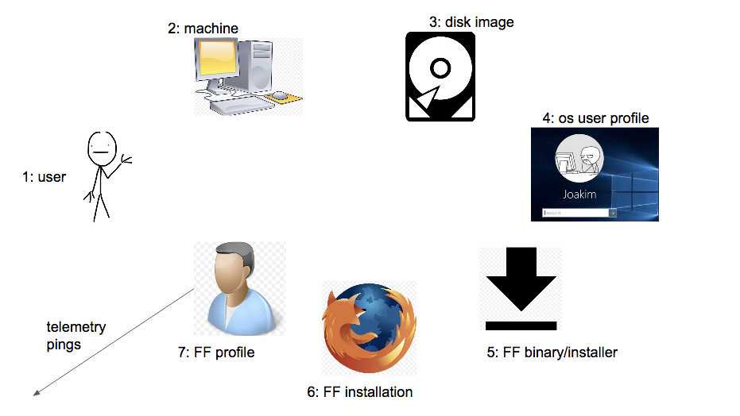
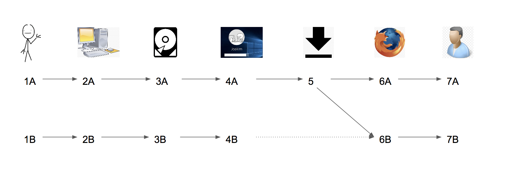

# Real World Usage

This page backs away from our profile-focused data view and examines what Firefox Desktop usage looks like in the real world. There are many components and layers that exist between a user acquiring and running Firefox, and this documentation will illuminate what those are and how they can affect the meaning of a profile.

## Real Life Components of Firefox Desktop Usage

The above image illustrates all the layers that sit between a user acquiring and running Firefox Desktop and the Telemetry pings we receive.

* 1: The user
	- A human being presumably.
* 2: The machine
	- The physical hardware running Firefox.
* 3: The disk image / hard drive
	- A single machine could have separate partitions running different OSes.
	- Multiple machines could run copies of a single disk image
	- Disk images are also used as backups to restore a machine.
* 4: OS user profile
	- Most operating systems allow users to log into different user profiles with separate user directories (such as a "Guest" accounts).
	- Usually, Firefox is installed into a system directory that all users profiles will share, but Firefox profiles are saved within the user directories, effectively segregating them.
* 5: Firefox binary / installer
	- The downloaded binary package or stub installer which installs Firefox into the hard drive. Users can get these from our website or one of our managed properties, but they can also acquire these from 3rd party sources as well.
	- Our website is instrumented with Google Analytics to track download numbers, but other properties (FTP) and 3rd party sources are not. Google Analytics data is not directly connected to Telemetry data.
	- A user can produce multiple installations from a single Firefox binary / installer. For example, if a user copies it to a USB stick or keeps it in cloud storage, they could install Firefox on multiple machines from a single binary / installer.
* 6: Firefox installation
	- The installed Firefox program on a given disk image.
	- Since Firefox is usually installed in a system directory, the single installation of Firefox will be shared by all the OS user profiles in the disk image.
	- Stub installers are instrumented with pings to report new install counts, however, full binaries are not.
* 7: Firefox profile
	- The profile Firefox uses during a user's session.
	- A user can create multiple Firefox profiles using the Firefox Profile Manager, or by specifying a custom directory to use at startup. More details [here](concepts/profile/profile_creation.md).
	- This is the entity that we see in Telemetry. Profiles send pings to Telemetry with a client ID as it's identifier.  

## Desktop Browser Use Cases

Below are the rough categories of Firefox use cases that we know happen in the real world.

Note, these categories are rough approximations, and are not necessarily mutually exclusive.

#### Regular User

What we imagine a typical user to be. Someone who buys a computer, always uses a default OS user profile, downloads Firefox once, installs it, and continues using the default Firefox profile.

In Telemetry, this user would just show up as a single client ID.

Assuming they went through our normal funnel, they should show up once in Google Analytics as a download and once in stub installer pings as a new installation (if they used a stub installer).

#### Multi-Profile User

A more advanced user, who uses multiple Firefox profiles in their normal, everyday use, but otherwise is pretty 'normal' (uses the same OS user profile, etc.).

In Telemetry, this user would show up as 2 (or more) separate client ID. We would have no way to know they came from the same computer and user.

Assuming they went through our normal funnel, they would show up once in Google Analytics as a download and once in stub installer pings as a new installation (if they used a stub installer).

However, any subsequent new Firefox profile creations would not have any corresponding downloads or installations.

#### Shared Computer

A situation where there is a computer that is shared across multiple users and each user uses a different OS user profile. Since Firefox profiles live at the user directory level, each user would have a separate Firefox profile. Note, users logging in under a "Guest" account in most machines falls into this category.

In this case, every user who logged into this one computer with a different OS user profile would show up as a different client ID. We have no way of knowing they came from the same computer.

Furthermore, if the computer wiped the user directory after use, like Guest accounts and university computer labs often do, then they would show up as a **new** client ID every time they logged in, even if they have used the same computer multiple times. This use case could inflate new profile counts.

Similar to Multi-Profile Users, in this use case, there would be only one download event and install event (assuming normal funnel and stub installer), but multiple client ID's.

#### Cloned Machines

In this case, there are actually multiple users with computers that all share the same disk image at some point.

Think of the situation where the IT staff sets up the computer for a new hire at a company. Instead of going through to trouble of installing all the required programs and setting them up correctly for each computer, they'll do it once on one computer, save the disk image, and simply copy it over each time they need to issue a new machine.

Or think of the case where the IT staff of a library needs to set up 2 dozen machines at once.

In this case, depending on the state of the disk image when it was copied, we could see multiple client ID's for each user+machine, or we could see all the user+machines sharing the same client ID.

If the disk image was copied after a Firefox profile was created, then the old user+machine and new user+machine will share the same client ID, and be submitting pings to us concurrently.

If the disk image was copied after the Firefox installation but before an initial Firefox profile was created, then each user+machine will get their own Firefox profile and client ID when they run Firefox for the first time.

As with the Multi-Profile User and Shared Computer case, even though there could be multiple Firefox profiles in this use case, there will only be one download and install event.  

#### Migrations

##### Type 1: Migrate Disk Image

A user has a backup of their disk image and when they switch to a new computer or their current computer crashes, they simply reboot from the old disk image.

In this case, the old machine and the new machine will just share the same client ID (assuming that the disk was copied after a Firefox profile was created). In fact, it will look exactly like the Cloned Machines case, except that instead of sending pings concurrently, they'll be sending us pings first from the old machine and then from the new machine.

Also, it should be noted that their Firefox profile will 'revert' back to the state that it was in when the disk image was copied, essentially starting over from the past, and any unsent pings on the image (if they exist) will be resent.

Again, there will only be one download and install associated with this use case (assuming normal funnel and stub installer).

##### Type 2: Migrate OS User Directory

A user has a backup of their OS user directory and copies it to a new machine.

This is similar to Type 1 migration, but instead of copying the entire disk, the user only copies the OS user directory. Since the Firefox profile lives in the OS user directory, the old machine and new machine will share the same client ID.

The only difference is since the Firefox Installation lives in system directories, the client might have to re-download and re-install the browser. However, if they also copy the Firefox binary / installer, there will not be a download event, only an install event.

##### Type 3: Migrate Firefox Binary / Installer

A user has the Firefox binary or installer saved on their old machine and copies it over to a new machine to install Firefox.

In this case, there will not be a second download event, but there will be an install event and the new and old machines will have separate client ID's.

##### Type 4: Migrate Firefox Profile

A user copies their old Firefox profile from their old machine to a new computer, and runs Firefox using the copied Firefox profile.

In this case, since the Firefox profile is being copied over, both the new and the old machine will have profiles with the same client ID. Again, the profile on the new computer will revert back to the point in it's history where it was copied.

If the Firefox binary / installer was downloaded, there will be a download and install event. If it was migrated via USB stick, it will only have an install event.

